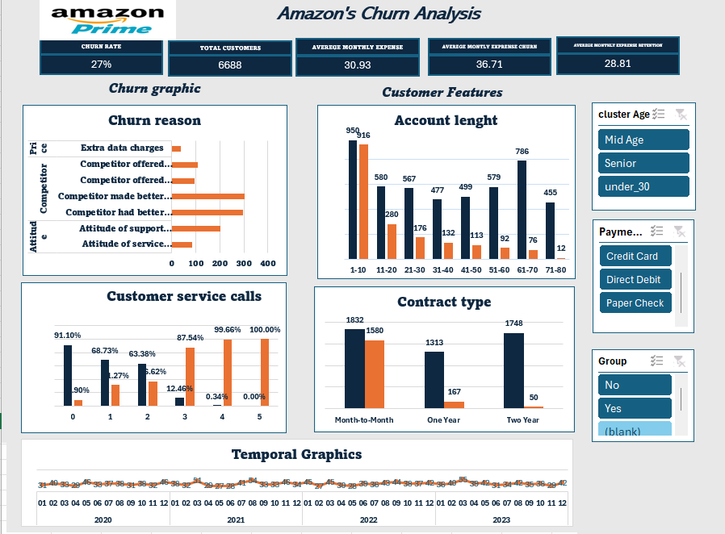

# Amazon Prime Customer Churn Analysis

   

# Project Description
This project involves an in-depth analysis of Amazon Prime customer data using Microsoft Excel. The primary objective is to understand the factors influencing customer retention and churn. By applying data cleaning, descriptive analysis, and exploratory techniques, the project aims to identify key patterns and factors contributing to customer attrition.

The final deliverable is an interactive dashboard that visualizes key metrics related to customer behavior. This dashboard will provide actionable insights, enabling strategic decision-making to improve customer retention and reduce churn.

The final outcome is an interactive dashboard that visualizes key metrics related to customer behavior, providing actionable insights for strategic decision-making.

# Folder Structure

      data_row

          amazon_churn_data_1
    
      data_analytic

         amazon_churn_descriptiva_numerica
    
         amazon_chunr_categorico
    
          amazon_chunr_data_analytic_descriptiva
    
      data_transformation

          amazon_chunr_datosbruto 1
    
      dashboard

          amazon_chunr_descriptiva_numerica
    
          dashboard

# Key Analysis Objectives
- Identify churn patterns: Understand the characteristics and behaviors of customers who cancel their subscriptions.
- Analyze retention factors: Identify the reasons behind long-term customer retention.
- Customer segmentation: Segment customers based on various factors like age, contract length, usage, and support calls.
- Visualize insights: Create an interactive dashboard to monitor and visualize churn and retention metrics.

# Dasboard

   

# Conclusion

Based on the analysis, the following insights were gathered:

- Overall Churn Rate: The churn rate is 27%, which suggests a significant area for improvement in retaining customers.

- Reasons for Churn: The primary reasons for churn are related to competition and customer experience issues. Customers who reported higher numbers of support calls were 
  more likely to churn, highlighting customer experience as a key factor.

- Retention Insights: Customers with longer contracts and those in group accounts tend to have better retention rates. This suggests that users who commit to longer periods    or join as part of a group are less likely to leave.
