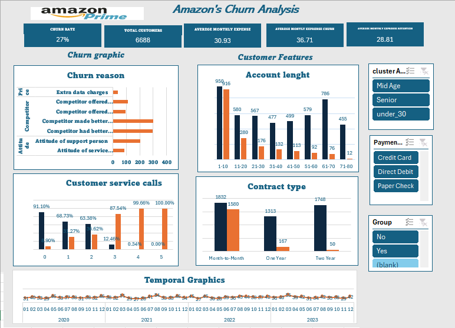

# Amazon Prime Customer Data Analysis Project

   

# Project Description
This project involves an in-depth analysis of Amazon Prime customer data using Microsoft Excel. The primary objective is to understand the factors influencing customer retention and churn by applying data cleaning, descriptive analysis, and exploratory techniques. The goal is to identify patterns and factors contributing to customer attrition.

The final outcome is an interactive dashboard that visualizes key metrics related to customer behavior, providing actionable insights for strategic decision-making.

# Folder Structure

data_row

    - ** amazon_churn_data_1
    
data_analytic

    - ** amazon_churn_descriptiva_numerica
    
    - ** amazon_chunr_categorico
    
    - ** amazon_chunr_data_analytic_descriptiva
    
data_transformation

    - **amazon_chunr_datosbruto 1
    
dashboard

    - **amazon_chunr_descriptiva_numerica
    
    - **dashboard

# dasboard

   

# conclusion

Conclusion:

-The overall churn rate is 27%, which indicates a significant area for improvement.

-The main reasons for churn are related to competition and customer experience issues, especially reflected in the number of support calls.

-Longer contracts and group accounts show better retention rates, suggesting that users who commit for longer periods or in groups are more likely to stay.

-It is recommended to optimize payment methods and run targeted campaigns for senior users to improve retention.
